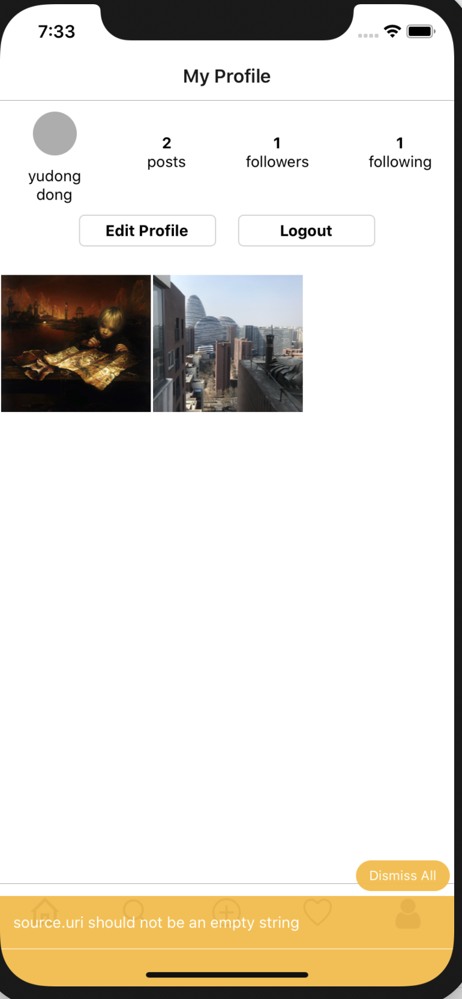

# AninalTravel
* 使用ReactNative开发的宠物旅游项目，**支持Android和iOS**~~

# Android扫码下载体验


# 运行方法
1. 克隆代码：

```
git clone https://github.com/luocooldong/AnimalTravel/tree/develop
```

2. 进入项目根目录并安装依赖：

```
cd AninalTravel
expo install
```

3. 运行项目到模拟器或真机：

```
// Android
expo start --android

// iOS
expo start --ios
```

# 注意
> Make sure you have an Android emulator running or a device connected and have set up your Android development environment


# 已实现功能
- [x] 拍照，动态，点赞，评论，关注， 登陆，注册等
- [x] 朋友圈点赞与评论

# 未实现功能
- [ ] 适配刘海屏

# 更新记录
* 2020-2-29 第一版体验版本

# 截图

## iOS截图（iPhone11）
<div>



</div>

## Android截图 (Sumang A70s)
<div>


</div>

